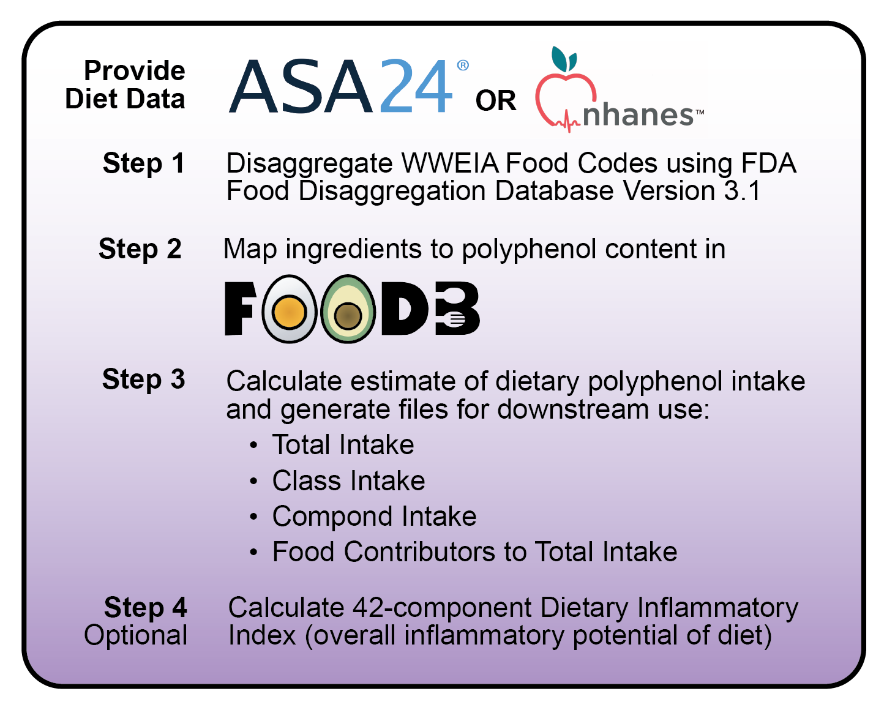

# Polyphenol Estimation Pipeline

This repository contains scripts to automate the estimation of dietary polyphenol intake and calculation of the dietary inflammatory index from ASA24 or NHANES diet recalls. 

### Releases
- November 20, 2025 - Tutorial Draft Release

## How it Works

<figure>
  
</figure>

## Get Started
Want to estimate polyphenols in your dietary data? Please review our start-up guide [here](https://swi1.github.io/polyphenol_pipeline/). If you are new to R and RStudio, you will need to download these free programs first in order to run the pipeline:
- **R** - available from [CRAN](https://cran.rstudio.com/)
- **RStudio** - available from [Posit](https://posit.co/download/rstudio-desktop/)

## Required Files
        
| Inputs      | Provided | About   |
|------------ |--------- |---------|
| Diet Data  | No     	| ASA24 Items File, or NHANES Note: Current pipeline requires each participant to have at least two recalls. 	|
| FDA Food Disaggregation Database V 3.1   | Yes  |   FDA's Food Disaggregation Database contains Ingredients and their percentages within FNDDS food codes. |
| FooDB food polyphenol content  | Yes      	|   Contains polyphenol content in foods. Polyphenols were determined based off structure (an aromatic ring with at least two hydroxyl groups) with 9 compounds manually added to better reflect microbial enzyme substrates.   |
| FooDB polyphenol list   | Yes      	| List of 3072 polyphenols. File includes FooDB compound ID, compound name, SMILES, InChI key, and taxonomic class. Taxonomic class is from ClassyFire, an automated chemical taxonomic classification application based on chemical structure.  |
| FDA-FDD v3.1 to FooDB Mapping   | Yes      	|  Linkage between FDA FDD Version 3.1 Ingredients to FooDB orig_food_common_name  |
| FooDB eugenol content | Yes | Contains eugenol content in foods. |
| FooDB polyphenol subclasses - DII | Yes | FooDB polyphenol taxonomic classes relevant to calculating the Dietary Inflammatory Index. |

