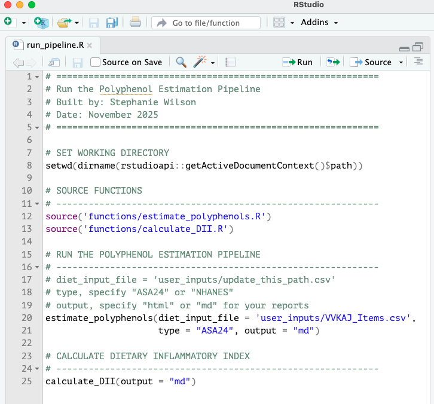
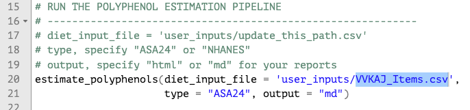

# Polyphenol Estimation Pipeline

This start guide shows you how to take your ASA24 or NHANES dietary data and estimate polyphenol intake using the [FooDB](https://foodb.ca/) and calculate the dietary inflammatory index[^1]. Example ASA24 data, borrowed from the DietDiveR Repository[^2], is provided for you to test. Check out [the example file here](https://github.com/SWi1/polyphenol_pipeline/blob/main/user_inputs/VVKAJ_Items.csv) to see the input structure required for the pipeline.

### 1. Download the entire repository directly [here](https://github.com/SWi1/polyphenol_pipeline/archive/refs/heads/main.zip) then unzip the folder. 
The repository contains files and scripts used in the tutorial.

###  2. Open 'run_pipeline.R' in RStudio.

### 3. Update `diet_input_file` path if not using the demo ASA24 data.

### 4. Run the script.
We are specifying that we are running ASA24 data and would like html reports from each pipeline step.

### 5. Check out the resulting files in your output directory!
You can see what was run in each script in the reports folder. Find a list of expected outputs below:
- [Polyphenol Estimation Pipeline Outputs](https://swi1.github.io/polyphenol_pipeline/webpages/polyphenol_estimation_pipeline.html#outputs)
- [DII Calculation Outputs](https://swi1.github.io/polyphenol_pipeline/webpages/DII_calculation.html#outputs)

See What's in Each Script

  <ul>
  For every script that was run, a report was generated in the reports folder. Check out the report for Step 2 of the polyphenol estimation pipeline which will tell you which foods did not map to FooDB for estimation of poylphenol content.  
  This tutorial actually shows you what the reports look like under "Polyphenol Estimation Pipeline" and "DII Calculation"!
  </ul>

### Want to test NHANES data instead?
`estimate_polyphenols` can also be run on NHANES data. To generate NHANES data, follow the instructions in ["Preparing Diet Data - NHANES diet recalls"](https://swi1.github.io/polyphenol_pipeline/webpages/preparing_diet_data_NHANES.html#prepare-nhanes-diet-recall-data). When you've finished: 
1. Come back to run_pipeline.R and update `diet_input_file` with the NHANES output. 
2. In `estimate_polyphenols()`, change type to "NHANES"
2. Run the script. 

[^1]: [Shivapppa et al. 2013. Designing and developing a literature-derived, population-based dietary inflammatory index](10.1017/S1368980013002115)
[^2]: [DietDiveR Repo](https://computational-nutrition-lab.github.io/DietDiveR/).
